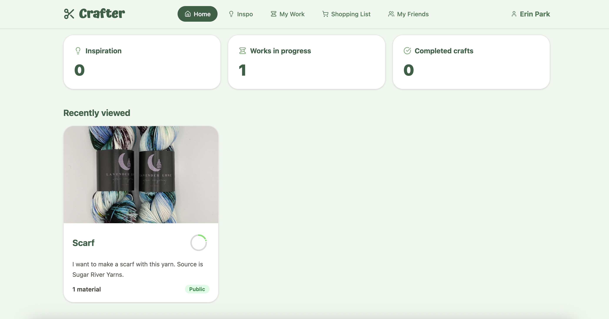

# Crafter

**Built by Northwestern CS 394 Spring 2026 — Team Blue**

A personal craft tracker for saving inspiration, logging works in progress, and recording completed projects. Share your crafts publicly or with specific friends.

**Live site:** [craft-app-bbf84.web.app](https://craft-app-bbf84.web.app/)  
**GitHub:** [394-s26/craft-app](https://github.com/394-s26/craft-app)

---

## What is it?

Crafter helps you organize your crafting life across three stages:

- **Inspiration** — save ideas from Instagram, Etsy, Pinterest, or anywhere. Attach a source URL, photos, and tags. Filter by tag on the Inspo page.
- **Work in Progress** — track active projects with photos, materials list, progress percentage, and notes.
- **Completed** — a finished gallery of things you've made.

Additional features:
- **Shopping list** — auto-generated from materials across all your active crafts
- **Friends** — add friends by email to share crafts with them directly
- **Sharing** — make any craft public (shareable link) or share privately with specific friends via email notification
- **Public view** — unauthenticated users can view public crafts via `/public/:craftId`

### Screenshot

> Add a screenshot here: drag an image into this section in GitHub, or place a file at `screenshots/home.png` and update the path below.

```

```

---

## Tech stack

| Layer | Technology |
|---|---|
| Frontend | React 19 + TypeScript |
| Build | Vite 8 + Tailwind CSS v4 |
| Auth | Firebase Auth (Google sign-in) |
| Database | Firebase Firestore |
| File storage | Firebase Storage |
| Hosting | Firebase Hosting |
| Email | Firebase Extensions — Trigger Email (via `mail` collection) |
| Icons | Lucide React |
| Images | libheif-js (HEIC/iPhone photo conversion) |
| Tests | Vitest + Testing Library |

---

## Local development

**Prerequisites:** Node 22+, npm, Firebase CLI

```bash
npm install
npm run dev
```

The app runs at `http://localhost:5173`.

### Environment variables

Create a `.env` file in the project root. All variables are required:

```
VITE_FIREBASE_API_KEY=...
VITE_FIREBASE_AUTH_DOMAIN=...
VITE_FIREBASE_PROJECT_ID=...
VITE_FIREBASE_STORAGE_BUCKET=...
VITE_FIREBASE_MESSAGING_SENDER_ID=...
VITE_FIREBASE_APP_ID=...
```

Get these values from the Firebase Console → Project Settings → Your apps → Web app → SDK setup and configuration.

### No seed data required

The app works with an empty Firestore database. Users sign in with Google and start creating crafts immediately.

---

## Firebase setup

### 1. Create a Firebase project

1. Go to [console.firebase.google.com](https://console.firebase.google.com) and click **Add project**.
2. Follow the wizard. You don't need Google Analytics.
3. In **Project Settings → General**, scroll to **Your apps**, click the web icon (`</>`), register the app, and copy the config values into your `.env` file.

### 2. Enable authentication

1. In the Firebase Console, go to **Build → Authentication → Sign-in method**.
2. Enable **Google** as a sign-in provider.
3. Add your domain (e.g. `localhost`, your Hosting URL) to the **Authorized domains** list.

### 3. Enable Firestore

1. Go to **Build → Firestore Database → Create database**.
2. Start in **production mode** (the security rules in `firestore.rules` handle access control).
3. Choose any region.

Security rules are deployed automatically with `firebase deploy`. The rules allow:
- Public crafts to be read without authentication
- Crafts to be read/written only by their owner or people they've been shared with
- Friendships to be managed only by the involved users

### 4. Enable Storage

1. Go to **Build → Storage → Get started**.
2. Start in production mode and choose a region matching Firestore.
3. Set these Storage security rules in **Storage → Rules**:

```
rules_version = '2';
service firebase.storage {
  match /b/{bucket}/o {
    match /users/{userId}/{allPaths=**} {
      allow read, write: if request.auth != null && request.auth.uid == userId;
    }
  }
}
```

### 5. Enable email (Trigger Email from Firestore extension)

Sharing a craft sends an email notification via the Firebase **Trigger Email from Firestore** extension. It watches the `mail` Firestore collection and delivers messages via SMTP. The app already writes to this collection — you just need to install the extension and point it at an SMTP server.

#### Step 1 — Create a Gmail App Password

The easiest SMTP source is a Gmail account with an App Password (required when 2-Step Verification is on — which it must be).

1. Go to your Google Account at [myaccount.google.com](https://myaccount.google.com).
2. Go to **Security → 2-Step Verification** and make sure it is **on**.
3. In the search bar at the top of the page search **"App passwords"** and open it (or go to [myaccount.google.com/apppasswords](https://myaccount.google.com/apppasswords)).
4. Under **App name**, type something like `Crafter Firebase` and click **Create**.
5. Copy the 16-character password that appears — you won't see it again.

Your SMTP connection string will be:

```
smtps://your-gmail@gmail.com:your-app-password@smtp.gmail.com:465
```

Replace `your-gmail@gmail.com` with the Gmail address and `your-app-password` with the 16-character code (no spaces).

#### Step 2 — Install the extension

1. In the [Firebase Console](https://console.firebase.google.com), go to **Extensions → Explore extensions**.
2. Search for **Trigger Email from Firestore** and click **Install**.
3. Choose the same project you set up above.
4. When prompted for configuration:
   - **SMTP connection URI**: paste the `smtps://...` string from Step 1
   - **Email documents collection**: `mail`
   - **Default FROM address**: the same Gmail address (e.g. `Crafter <your-gmail@gmail.com>`)
   - Leave all other fields at their defaults.
5. Click **Install extension** and wait for it to finish (takes ~2 minutes).

#### Step 3 — Test it

Share a craft with a friend's email from the craft detail page. Within a few seconds a document will appear in the `mail` collection in Firestore, and the extension will deliver the email. If it fails, check **Extensions → Trigger Email → Logs** in the Firebase Console for the error.

> **Note:** Gmail limits free accounts to 500 emails/day. For production with higher volume, swap the SMTP string for [Resend](https://resend.com) or [SendGrid](https://sendgrid.com) — the rest of the setup is identical.

### 6. Install the Firebase CLI and deploy

```bash
npm install -g firebase-tools
firebase login
npm run build
firebase deploy --project <your-project-id>
```

To switch between projects:

```bash
firebase use <project-id>
firebase deploy
```

---

## Scripts

| Script | Description |
|---|---|
| `npm run dev` | Start Vite dev server at localhost:5173 |
| `npm run build` | TypeScript check + production build to `dist/` |
| `npm run preview` | Preview the production build locally |
| `npm test` | Run tests with Vitest UI |
| `npm run coverage` | Run tests with coverage report |
| `firebase deploy --project <id>` | Deploy hosting + Firestore rules to production |

---

## Data model

### Craft

| Field | Type | Description |
|---|---|---|
| `id` | string | Firestore document ID |
| `userId` | string | Owner's Firebase Auth UID |
| `title` | string | Craft name |
| `description` | string | Notes / details |
| `status` | `'inspiration' \| 'work-in-progress' \| 'completed'` | Current stage |
| `materials` | string[] | List of materials |
| `photos` | `{id, url, alt}[]` | Uploaded photos (Firebase Storage URLs) |
| `progress` | number | Completion percentage (0–100) |
| `isPublic` | boolean | Whether the craft is publicly viewable |
| `sharedWith` | string[] | Emails of users with private access |
| `tags` | string[] | Tags for filtering (inspiration only) |
| `sourceUrl` | string? | Original inspiration URL (legacy field) |
| `sources` | CraftSource[] | Structured sources (external URL or linked craft) |
| `createdAt` | string | ISO timestamp |
| `updatedAt` | string | ISO timestamp |

### Friendship

| Field | Type | Description |
|---|---|---|
| `fromUserId` | string | UID of the user who added the friend |
| `toEmail` | string | Email of the friend |

---

## Known bugs

- **Stale `sourceUrl` field** — older craft documents may have a `sourceUrl` string field instead of the newer `sources` array. The app reads both formats, but saving an old craft with an empty `sourceUrl` can cause a Firestore write error if not stripped (fixed in `craftService.ts` — but existing documents may still have the field).
- **HEIC conversion on Chrome (Windows/Linux)** — HEIC conversion relies on `libheif-js` wasm, which adds ~1.5 MB to the bundle. Conversion may be slow or fail on low-memory devices.
- **Shopping list deduplication** — materials with slightly different casing or spacing (e.g. "Yarn" vs "yarn") are treated as separate items.
- **Friend emails are case-sensitive** — `Friend@Email.com` and `friend@email.com` are treated as different users. Emails should be lowercased on entry (partially enforced in the email share form but not the friend invite form).
- **No offline support** — the app requires an active internet connection; there is no caching or offline fallback.
